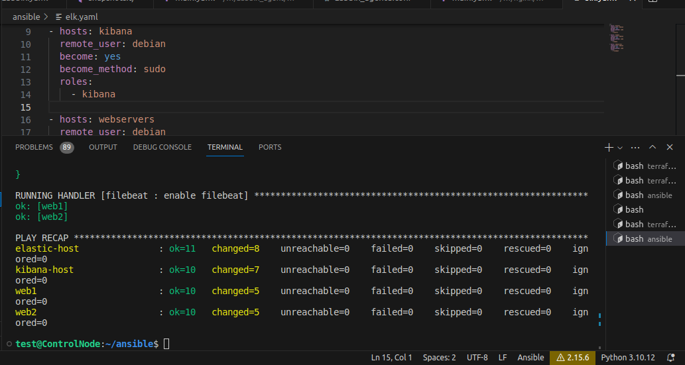

# Задача

Ключевая задача — разработать отказоустойчивую инфраструктуру для сайта, включающую мониторинг, сбор логов и резервное копирование основных данных. Инфраструктура должна размещаться в [Yandex Cloud](https://cloud.yandex.com/) и отвечать минимальным стандартам безопасности.

## Инфраструктура

Для развёртки инфраструктуры используйте Terraform и Ansible.

Не используйте для ansible inventory ip-адреса! Вместо этого используйте fqdn имена виртуальных машин в зоне ".ru-central1.internal". Пример: example.ru-central1.internal

### Сайт

Создайте две ВМ в разных зонах, установите на них сервер nginx, если его там нет. ОС и содержимое ВМ должно быть идентичным, это будут наши веб-сервера.

Используйте набор статичных файлов для сайта. Можно переиспользовать сайт из домашнего задания.

Создайте [Target Group](https://cloud.yandex.com/docs/application-load-balancer/concepts/target-group), включите в неё две созданных ВМ.

Создайте [Backend Group](https://cloud.yandex.com/docs/application-load-balancer/concepts/backend-group), настройте backends на target group, ранее созданную. Настройте healthcheck на корень (/) и порт 80, протокол HTTP.

Создайте [HTTP router](https://cloud.yandex.com/docs/application-load-balancer/concepts/http-router). Путь укажите — /, backend group — созданную ранее.

Создайте [Application load balancer](https://cloud.yandex.com/en/docs/application-load-balancer/) для распределения трафика на веб-сервера, созданные ранее. Укажите HTTP router, созданный ранее, задайте listener тип auto, порт 80.

Протестируйте сайт `curl -v <публичный IP балансера>:80`

### [](https://github.com/netology-code/sys-diplom/tree/diplom-zabbix#%D0%BC%D0%BE%D0%BD%D0%B8%D1%82%D0%BE%D1%80%D0%B8%D0%BD%D0%B3)Мониторинг

Создайте ВМ, разверните на ней Zabbix. На каждую ВМ установите Zabbix Agent, настройте агенты на отправление метрик в Zabbix.

Настройте дешборды с отображением метрик, минимальный набор — по принципу USE (Utilization, Saturation, Errors) для CPU, RAM, диски, сеть, http запросов к веб-серверам. Добавьте необходимые tresholds на соответствующие графики.

### [](https://github.com/netology-code/sys-diplom/tree/diplom-zabbix#%D0%BB%D0%BE%D0%B3%D0%B8)Логи

Cоздайте ВМ, разверните на ней Elasticsearch. Установите filebeat в ВМ к веб-серверам, настройте на отправку access.log, error.log nginx в Elasticsearch.

Создайте ВМ, разверните на ней Kibana, сконфигурируйте соединение с Elasticsearch.

### [](https://github.com/netology-code/sys-diplom/tree/diplom-zabbix#%D1%81%D0%B5%D1%82%D1%8C)Сеть

Разверните один VPC. Сервера web, Elasticsearch поместите в приватные подсети. Сервера Zabbix, Kibana, application load balancer определите в публичную подсеть.

Настройте [Security Groups](https://cloud.yandex.com/docs/vpc/concepts/security-groups) соответствующих сервисов на входящий трафик только к нужным портам.

Настройте ВМ с публичным адресом, в которой будет открыт только один порт — ssh. Эта вм будет реализовывать концепцию [bastion host](https://cloud.yandex.ru/docs/tutorials/routing/bastion) . Синоним "bastion host" - "Jump host". Подключение ansible к серверам web и Elasticsearch через данный bastion host можно сделать с помощью [ProxyCommand](https://docs.ansible.com/ansible/latest/network/user_guide/network_debug_troubleshooting.html#network-delegate-to-vs-proxycommand) . Допускается установка и запуск ansible непосредственно на bastion host.(Этот вариант легче в настройке)

### [](https://github.com/netology-code/sys-diplom/tree/diplom-zabbix#%D1%80%D0%B5%D0%B7%D0%B5%D1%80%D0%B2%D0%BD%D0%BE%D0%B5-%D0%BA%D0%BE%D0%BF%D0%B8%D1%80%D0%BE%D0%B2%D0%B0%D0%BD%D0%B8%D0%B5)Резервное копирование

Создайте snapshot дисков всех ВМ. Ограничьте время жизни snaphot в неделю. Сами snaphot настройте на ежедневное копирование.

# Решение

Для начала развернём всю необходимую инфраструктуру с помощью terraform.
1. Создадим отдельную папку terraform для хранения необходимых файлов. Там же создадим файлы: 
	main.tf с описанием облачного провайдера,
	vm.tf где будут описаны наши инстансы,
	net.tf с описанием сетей и всем что с ними связанно,
	var.tf файл с переменными,
	snapshots.tf файл с описывает создание снимков дисков,
	output.tf вернет нам после создания необходимые данные такие как ip адреса и fqdn,\
	meta.yaml для метаданных для установки серверов nginx
После того как мы опишем облачного провайдера выполним `terraform init`
Затем начнем заполнять наши файлики с ресурсами. Как всё будет готово выполним `terraform apply`  и terraform начнёт поднимать нашу инфраструктуру, и по итогу выведет нам те значения которые мы указали в файле output.tf 

Наша инфраструктура готова, теперь перейдем к созданию ansible playbooks
2. Создадим отдельную папку для ansible. В ней создадим файлы и папки:
    ansible.cfg конфигурация конфига.
    hosts файл с хостами
    elk.yaml playbook разворачивающий elastic, kibana, filebeat
    zabbix.yaml playbook разворачивающий zabbix server и zabbix agent
    roles/ папка с ролями 
(Веб-сервера разворачивать будет terraform)
Отредактируем файл конфигурации ansible.cfg
Файл hosts заполним из вывода output.
После того как все плейбуки будут написаны а роли созданы можно их запускать.
```
ansible all -m ping # Проверим доступность хостов
ansible-playbook elk.yaml
ansible-playbook zabbix.yaml
```




3. Проверим работоспособность веб-серверов через load balancer, ELK и zabbix
	
	
	Сервера работают, при повторном подключении по ip балансера мы видим другой хостнейм. Напомню их мы записали в index.html при создании веб-серверов в файле meta.yaml
	-
	Теперь зайдем подключимся к kibana перейдя по её внешнему ip на порт 5601
	
	Как мы видим наши посещения веб-серверов отображается, значит всё работает.
	-
	Далее пойдем по внешнему ip zabbix сервера указав /zabbix , настроим zabbix указав пароль от базы данных, и заходим по логин и паролю по умолчанию: Admin/zabbix
	
	Всё работает, после входа, нужно подредактировать конфиги обнаружения, добавить наши подсети, и включить задачу автоматического обнаружения хостов и добавления их в группу linux. Когда хосты будут найдены создадим несколько дашбордов.
	
	

На этом задачи дипломной работы можно считать выполненными.


